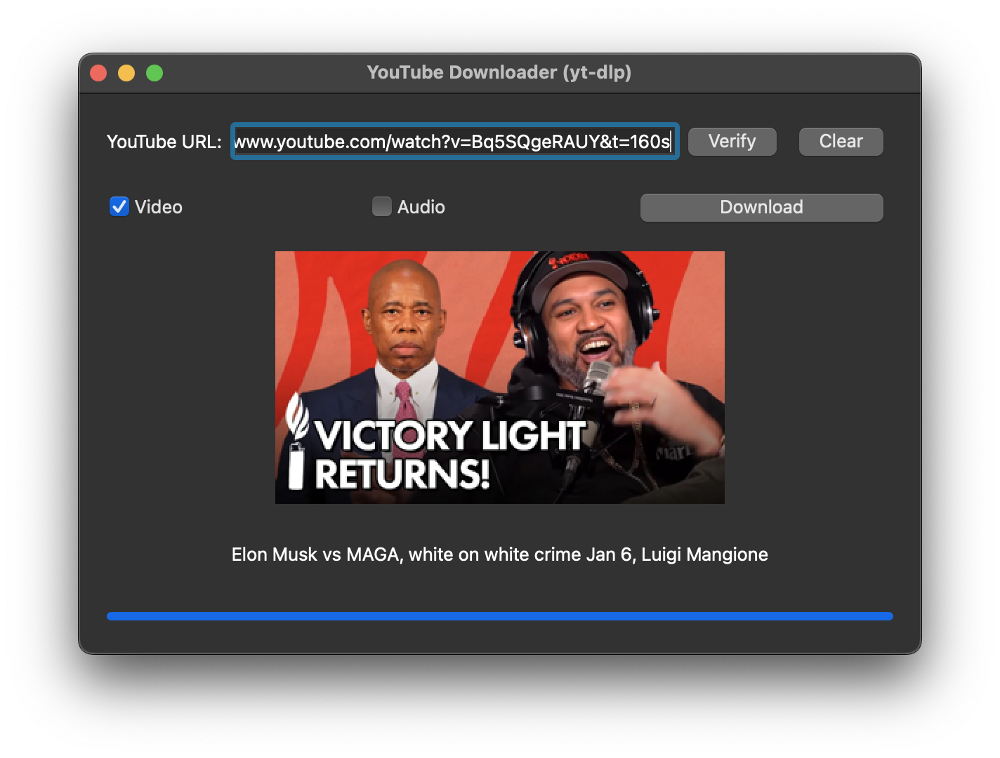

# PyQt YouTube Downloader

A modern, user-friendly YouTube downloader application built with PyQt and `yt-dlp`. This application allows users to download YouTube videos or extract audio in MP3 format using a graphical user interface (GUI).

## Features

- **Video and Audio Download**: Download videos in the best quality or extract audio in MP3 format.
- **Thumbnail Preview**: Automatically fetch and display the video thumbnail before downloading.
- **Progress Bar**: Real-time download progress updates to keep users informed.
- **Threaded Downloads**: Keeps the application responsive during downloads.
- **Error Handling**: Displays detailed error messages for failed downloads.

## Screenshots



## Requirements

- Python 3.7 or later
- `yt-dlp` for downloading videos and extracting audio
- `ffmpeg` for MP3 audio conversion (optional but recommended)

## Installation

1. Clone this repository:
   ```bash
   git clone https://github.com/your-username/pyqt-youtube-downloader.git
   cd pyqt-youtube-downloader
   ```

2. Set up a virtual environment (optional but recommended):
   ```bash
   python3 -m venv venv
   source venv/bin/activate  # For macOS/Linux
   venv\Scripts\activate     # For Windows
   ```

3. Install dependencies:
   ```bash
   pip install -r requirements.txt
   ```

4. Install `yt-dlp`:
   ```bash
   pip install yt-dlp
   ```

5. Install `ffmpeg` (optional, for MP3 conversion):
   - macOS: `brew install ffmpeg`
   - Ubuntu/Debian: `sudo apt-get install ffmpeg`
   - Windows: [Download FFmpeg](https://ffmpeg.org/download.html)

## Usage

1. Run the application:
   ```bash
   python pyqt_youtube_downloader.py
   ```

2. Enter a YouTube video URL in the text field and click **Verify**.
3. Choose whether to download the video, audio, or both using the checkboxes.
4. Click the **Download** button and select a folder to save the downloaded file(s).
5. Monitor the progress bar as your file downloads.

## Troubleshooting

- **Audio file not downloaded**:
  - Ensure `ffmpeg` is installed and correctly configured in your system's PATH.
  - Verify that the target folder is writable.

- **Error during video verification**:
  - Ensure the video URL is accessible (no region restrictions).
  - Make sure you have the latest version of `yt-dlp`:
    ```bash
    pip install --upgrade yt-dlp
    ```

- **GUI Freezing or Crashing**:
  - Ensure all dependencies are correctly installed.
  - If the issue persists, file a bug report.

## Development

To contribute to this project:

1. Fork the repository.
2. Create a feature branch:
   ```bash
   git checkout -b feature-name
   ```
3. Commit your changes:
   ```bash
   git commit -m "Add new feature"
   ```
4. Push the branch and create a pull request.

## Dependencies

- **PyQt5**: For the GUI interface
- **yt-dlp**: For downloading videos and extracting audio
- **requests**: For fetching thumbnails
- **Pillow**: For image processing
- **ffmpeg** (optional): For MP3 audio conversion

## License

This project is licensed under the MIT License. See the [LICENSE](LICENSE) file for details.

## Acknowledgments

- [yt-dlp](https://github.com/yt-dlp/yt-dlp) for providing a robust video downloading backend.
- [FFmpeg](https://ffmpeg.org/) for handling audio conversion.
- [PyQt](https://riverbankcomputing.com/software/pyqt/intro) for the GUI framework.

## Contact

If you encounter issues or have suggestions for improvement, please open an issue or contact [your-email@example.com](mailto:your-email@example.com).

---

Happy downloading! 🚀
